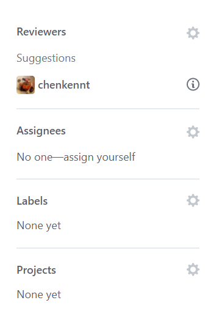
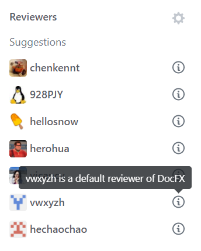

# Super GitHub
This is a chrome extension to improve github user experience.

# Features
When you create a PR to https://github.com/dotnet/docfx (hardcoded):

This extension will load all the DocFX guys (yes, also hardcoded) to suggestions:

# Install
1. `git clone https://github.com/superyyrrzz/super-github.git`
2. Drag the folder "super-github" into Chrome's extension page `chrome://extensions`
3. Refresh the page.
